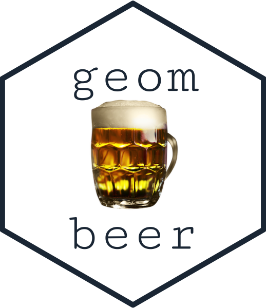

<!-- README.md is generated from README.Rmd. Please edit that file -->

```{r, include = FALSE}
knitr::opts_chunk$set(
  collapse = TRUE,
  comment = "#>",
  fig.path = "man/figures/README-",
  out.width = "100%"
)
library(geombeer)
```


```{r echo = FALSE, eval = FALSE}
library(magick)
library(showtext)
library(hexSticker)
font_add_google("Cutive Mono", "gf")
```

```{r echo = FALSE, eval = FALSE}
img <- image_read("man/img/pint.png")
 logo <- hexSticker::sticker(subplot  = img,
                    s_x      = 1,
                    s_y      = 1,
                    s_width  = 0.8,
                    s_height = 0.95,
                    package  = "geom\n\nbeer",
                    p_x      = 1,
                    p_y      = 1,
                    p_color  = "#223344",
                    p_family = "gf",
                    p_size   = 9,
                    h_size   = 1.2,
                    h_fill   = "#ffffff",
                    h_color  = "#223344",
                    filename = "man/img/logo.png")
image_read("man/img/logo.png")
```
# geombeer 

<!-- badges: start -->


<!-- badges: end -->

`geombeer` is a package that that creates cool images of refreshing alcoholic beverages and yummy bar food. This was mainly built for my [R Shiny](https://andrewcli.shinyapps.io/andrews_bar/) app but I think anyone can enjoy this package. 

### What's in the package so far?

* `geom_beer()` creates a can of ice cold beer
* `geom_redwine()`creates a bottle of red wine
* `geom_whitewine()`creates a bottle of white wine
* `geom_gin()` creates a bottle of gin (aesthetics inspired by [Bombay sapphire](https://www.bombaysapphire.com))
* `geom_hotdog()`creates a yummy hot dog

### Installation

You can install from [GitHub](https://github.com/andr3wli/geombeer) with:

``` r
devtools::install_github("andr3wli/geombeer")
```

### Example: `geom_beer()`

This is how you create a cold one in r

```{r example}
library(ggplot2)
library(geombeer)

ggplot() +
  geom_beer() +
  theme_void()
```
### Example: `geom_gin()`

```{r}
ggplot() +
  geom_gin() +
  theme_void()
```

### Example: `geom_hotdog()`
```{r}
ggplot() +
  geom_hotdog() +
  theme_void()
```

### Acknowledgements

A huge thank you to [Georgios Karamanis](https://t.co/crHTOelx3S?amp=1)! He is the one who created the original hot dog and I modified his code to give it some friends. Georgios is super nice and I am grateful for his help and code.  

### Code of Conduct

Please note that the geombeer project is released with a [Contributor Code of Conduct](https://contributor-covenant.org/version/2/0/CODE_OF_CONDUCT.html). By contributing to this project, you agree to abide by its terms.
